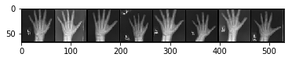

# X-Ray GAN
This is a simple GAN that was trained on x-ray images of hands and can now produce new synthetic x-ray images as needed.

It's just a fun little toy I put together to study how GANs work.

### Real Images

### Generated Images

## Dataset
The dataset that was used for training is the RNSA Bone Age dataset from Kaggle.It's a 9GB dataset with about 12,000 training images. I used a script (included in the repo) to downsize the high-res images before training.

The dataset can be obtained at https://www.kaggle.com/kmader/rsna-bone-age
